# Challenge 0 - Setup the environment

## Introduction

To introduce you to the "world of chaos engineering", we will be using a typical cloud-native application that runs on top of an Azure-hosted Kubernetes cluster as our "target". The application is called "Simple Contacts Management" and gives users the ability to manage contacts and visit reports, a very tiny CRM, so to say.

It runs on several Azure and in-cluster services like SQL Server, [CosmosDB](https://docs.microsoft.com/en-us/azure/cosmos-db/introduction) (for NoSQL data), [Azure Search](https://docs.microsoft.com/en-us/azure/search/search-what-is-azure-search) (for providing full-text search capabilities) and [Azure Storage Accounts](https://docs.microsoft.com/en-us/azure/storage/common/storage-account-overview) (for blob storage). It also uses [Azure Service Bus](https://docs.microsoft.com/en-us/azure/service-bus-messaging/service-bus-messaging-overview) to decouple services from each other. None of the services directly calls one another to retrieve information from it. 

If information needs to be exchanged, messages are put into the Service Bus - either on a queue or a topic (to be able to have multiple subscribers). So, e.g., if the search index for contacts needs to be updated, the corresponding service (`Contacts API`) does not call the Azure service directly. It will put a message on the Azure Service Bus that the contact has been updated. In the background, a worker "function" listens on that topic, picks-up the message and updates the search index. That's how the application works in general.

The architecture - from a 10.000ft view - looks like this:

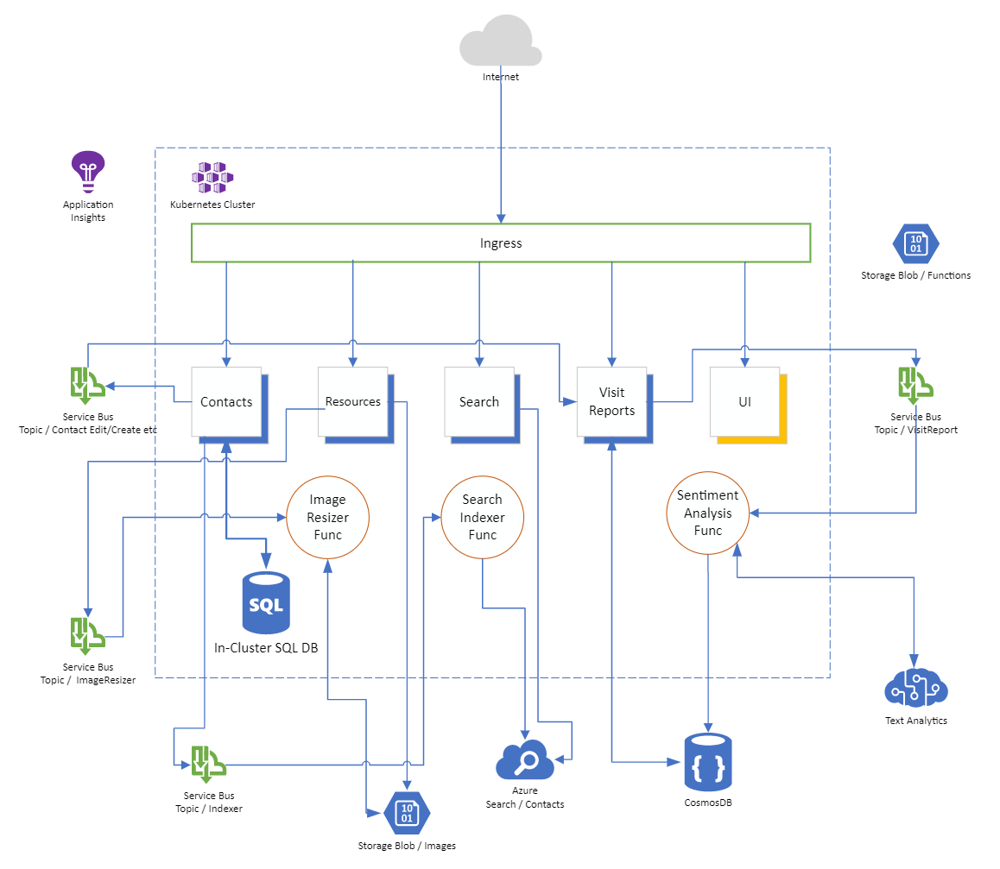

The application also consists of a frontend that has been written in VueJS. To give you a brief overview, here are some views:

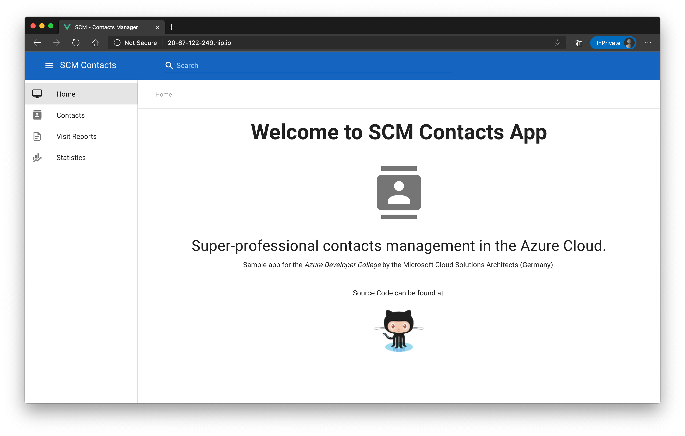
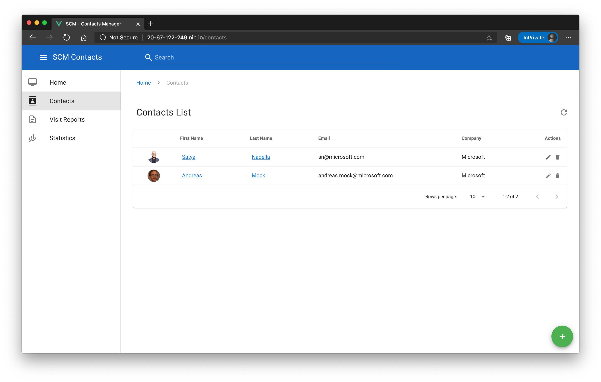
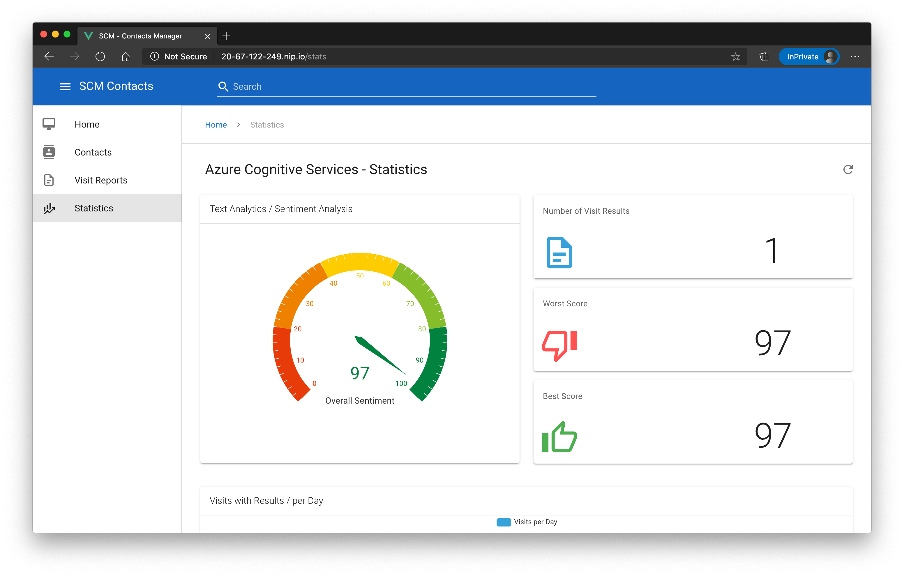

## Setup the Azure Cloud Shell

To have a common environment for this workshop, we will be using the `Azure Cloud Shell` in a browser. The cloud shell gives you an interactive bash shell, where most of the requirements for this workshop are in already in-place - like the `Azure CLI`, `terraform`, `kubectl` etc.

To setup your environment, go to <https://shell.azure.com> and follow the wizard. Make sure to select `bash`.

In case you are working in an existing Azure environment - especially when you have access to multiple subscriptions - please check that you are working with the correct Azure subscription.

```shell
$ az account show
{
  "cloudName": "AzureCloud",
  "id": "xxxxxxxx-xxxx-xxxx-xxxx-xxxxxxxxxxxx",
  "isDefault": false,
  "name": "Your Subscription Name",
  "state": "Enabled",
  "tenantId": "xxxxxxxx-xxxx-xxxx-xxxx-xxxxxxxxxxxx",
  "user": {
    "name": "xxx@example.com",
    "type": "user"
  }
}
```

If that is not the correct one, follow the steps below:

```shell
$ az account list -o table
[the list of available subscriptions is printed]

$ az account set -s <SUBSCRIPTIONID_YOU_WANT_TO_USE>
```

## Create the Kubernetes Cluster

In this section, we will create a managed Kubernetes cluster on [Azure Kubernetes Service](https://docs.microsoft.com/en-us/azure/aks/) using the Azure CLI and configure your local access credentials to control your cluster via `kubectl`.

First and foremost, let's create a resource group where we will install the cluster to:

```shell
$ az group create -n <ResourceGroupName> -l westeurope
```

Please use for the resource group name the name policy: `<your-initials>-aks-rg`.

Next, create the cluster (this will take approximately 5-10min.):

```shell
$ az aks create \
   --resource-group <ResourceGroupName> \
   --name <ClusterName> \
   --node-count 3 \
   --enable-managed-identity \
   --node-vm-size standard_b2s \
   --network-plugin azure \
   --generate-ssh-keys
```

Please use for the aks cluster group name the name policy: `<your-initials>-aks-cluster`.

The command above will create a Kubernetes cluster in the "West Europe" region and will place our three worker nodes in three different [availability zones](https://docs.microsoft.com/en-us/azure/availability-zones/az-overview).

When the cluster has been created, download the access credentials:

```shell
$ az aks get-credentials -g <ResourceGroupName> -n <ClusterName>
```

When you are all set, let's query the nodes we have in our cluster (the version may differ in your case):

```shell
$ kubectl get nodes
NAME                                STATUS   ROLES   AGE   VERSION
aks-nodepool1-41662097-vmss000000   Ready    agent   8h    v1.18.14
aks-nodepool1-41662097-vmss000001   Ready    agent   8h    v1.18.14
aks-nodepool1-41662097-vmss000002   Ready    agent   8h    v1.18.14
```

## Create the infrastructure and deploy the application

Now that we have a Kubernetes cluster up and running, let's deploy the application with all its dependencies (like Azure Service Bus, CosmosDB, Azure Search etc.). To avoid a manual setup of all those components, we created a Terraform script that does all the "heavy lifting" for you.

Therefor, we need to clone this repo into the Azure Cloud Shell environment. Let's do this:

```shell
$ git clone https://github.com/azuredevcollege/chaos-eng-workshop.git

Cloning into 'chaos-eng-workshop'...
remote: Enumerating objects: 409, done.
remote: Counting objects: 100% (409/409), done.
remote: Compressing objects: 100% (276/276), done.
remote: Total 409 (delta 117), reused 391 (delta 101), pack-reused 0
Receiving objects: 100% (409/409), 2.12 MiB | 4.56 MiB/s, done.
Resolving deltas: 100% (117/117), done.
```

> Info: In this repository, you will find all assets of this workshop, even the application itself.

Now switch to the `terraform` directory and initialize `terraform`:

```shell
$ cd chaos-eng-workshop/terraform
$ terraform init

Initializing modules...
- common in common
- data in data
- kubernetes in kubernetes
- messaging in messaging
- storage in storage

Initializing the backend...
[...]
[...]
[...]
Terraform has been successfully initialized!
```

Finally, apply the script:

```shell
$ terraform apply \
  -var="prefix=<yourprefix>" \
  -var="location=westeurope" \
  -var="aks_resource_group_name=<ResourceGroupName>" \
  -var="akscluster=<ClusterName>"
```

Confirm the prompt with `yes` during execution:

```shell
Do you want to perform these actions?
  Terraform will perform the actions described above.
  Only 'yes' will be accepted to approve.

  Enter a value: yes
```

After the script has finished (appr. after another 10-15 min.), you will see something like this:

```shell
[...]
[...]
[...]
Apply complete! Resources: 54 added, 0 changed, 0 destroyed.

Outputs:

ai_ik = "2f45db5e-8b53-47d7-8aeb-3884082ca961"
nip_hostname = "104-45-73-97.nip.io"
```

## Smoke Test

### Kubernetes Deployments & Pods

Because all deployments of the demo application take place in the `contactsapp` namespace, we first set this namespace as the new default for kubectl.

```shell
kubectl config set-context --current --namespace=contactsapp
```

Check all deployments: All deployments must be `ready`

```shell
$kubectl get deployments

NAME                            READY   UP-TO-DATE   AVAILABLE   AGE
ca-deploy                       1/1     1            1           3h31m
frontend-deploy                 1/1     1            1           3h36m
mssql-deployment                1/1     1            1           3h31m
resources-deploy                1/1     1            1           3h31m
resources-function-deploy       1/1     1            1           3h31m
search-deploy                   1/1     1            1           3h31m
search-function-deploy          1/1     1            1           3h31m
textanalytics-function-deploy   1/1     1            1           3h31m
visitreports-deploy             1/1     1            1           3h31m
```

Check all pods: All pods must be `ready` and `Running`

```shell
$kubectl get pods

NAME                                             READY   STATUS    RESTARTS   AGE
ca-deploy-56d84bcf47-nlzp8                       1/1     Running   0          3h33m
frontend-deploy-5d85979b7b-v2tgk                 1/1     Running   0          3h38m
mssql-deployment-5998699cd8-cp6zv                1/1     Running   0          3h33m
resources-deploy-7f5f968587-6j8cc                1/1     Running   0          3h33m
resources-function-deploy-58744cb66-c8qdf        1/1     Running   0          3h33m
search-deploy-f7789698-vk6fx                     1/1     Running   0          3h33m
search-function-deploy-84b4b6bc84-dn7pr          1/1     Running   0          3h33m
textanalytics-function-deploy-6bc56f6b8c-8pr67   1/1     Running   0          3h33m
visitreports-deploy-5fc8bf9cf5-q97dr             1/1     Running   0          3h33m
```


### Web-UI

You can now copy & paste the value of the variable `nip_hostname` and open the URL in a browser, in this case <http://104-45-73-97.nip.io>. You should now see the SCM Contacts Management application.


## Monitoring

When running the terraform script, we also created a service that is helping us with monitoring our application running in the Kubernetes cluster: [Application Insights](https://docs.microsoft.com/en-us/azure/azure-monitor/app/app-insights-overview)! Each service (API, background service, frontend) is talking to Application Insights (via an instrumentation key) and sending telemetry data like request/response times, errors that may have occurred, how our users navigate through the frontend etc.

Navigate to the Application Insights component in the portal (in the "common resource group") and check the data that is sent to that service (of course, you need to use the application for a while, before data arrives in the monitoring service):

### Application Map

The application map gives you an overview of our components and how they communicate:

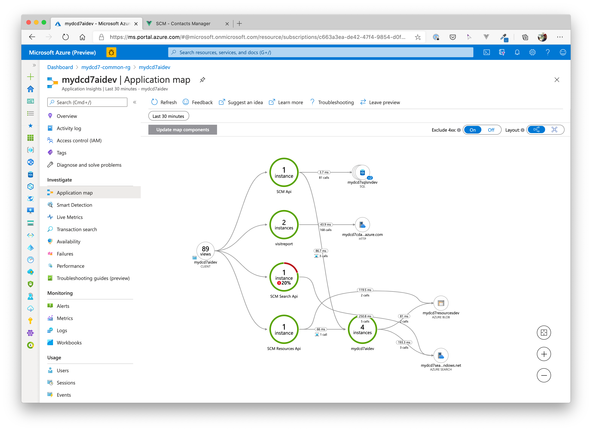
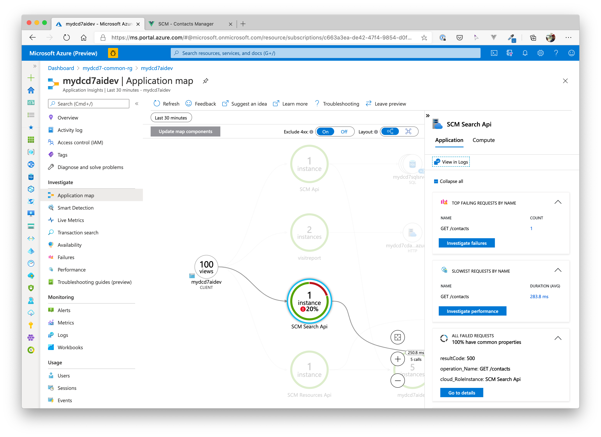

### Application Performance

The performance view, shows you how the app behaves in terms of request/response performance.

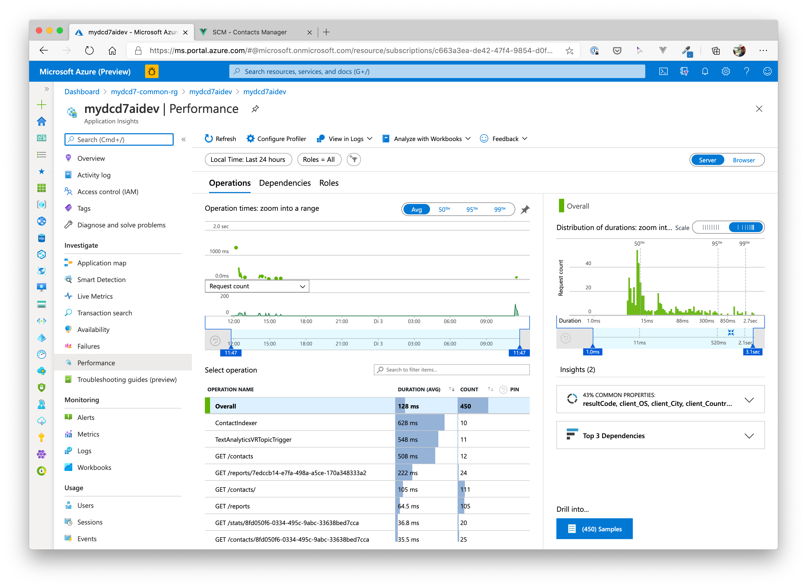

### Application User Events / Frontend Integration

Even the frontend sends telemetry data. You can see how a user navigates through the application.

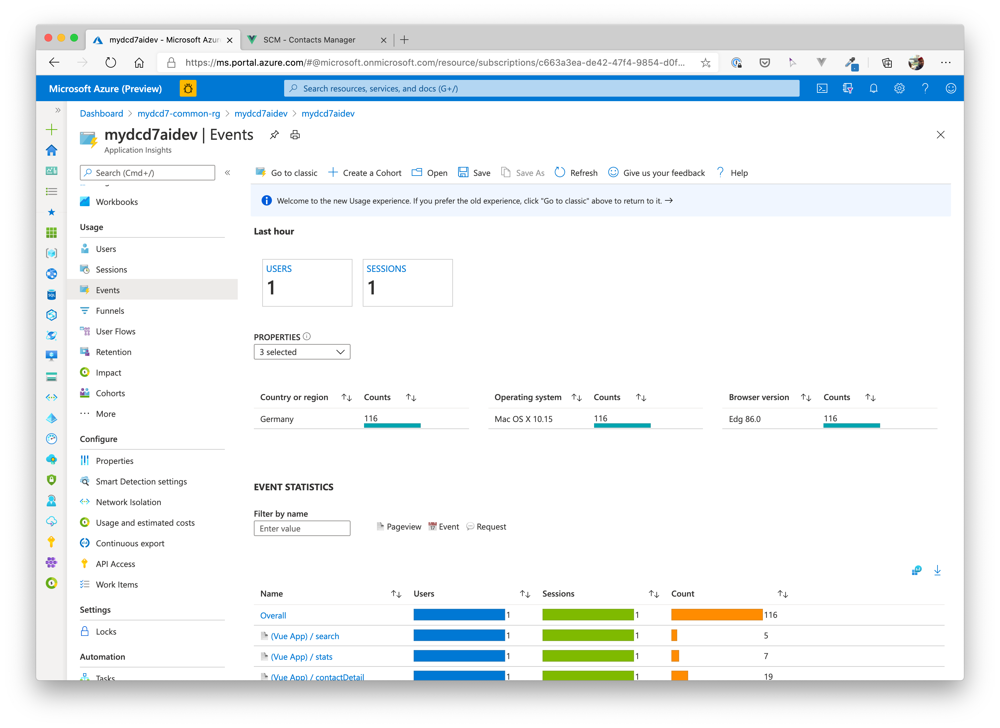

### Application End2End Transactions

In this view, you can see cross-component transactions, e.g. the Contacts service querying data in the Azure SQL DB or sending data via Azure Service Bus to a background worker / function.

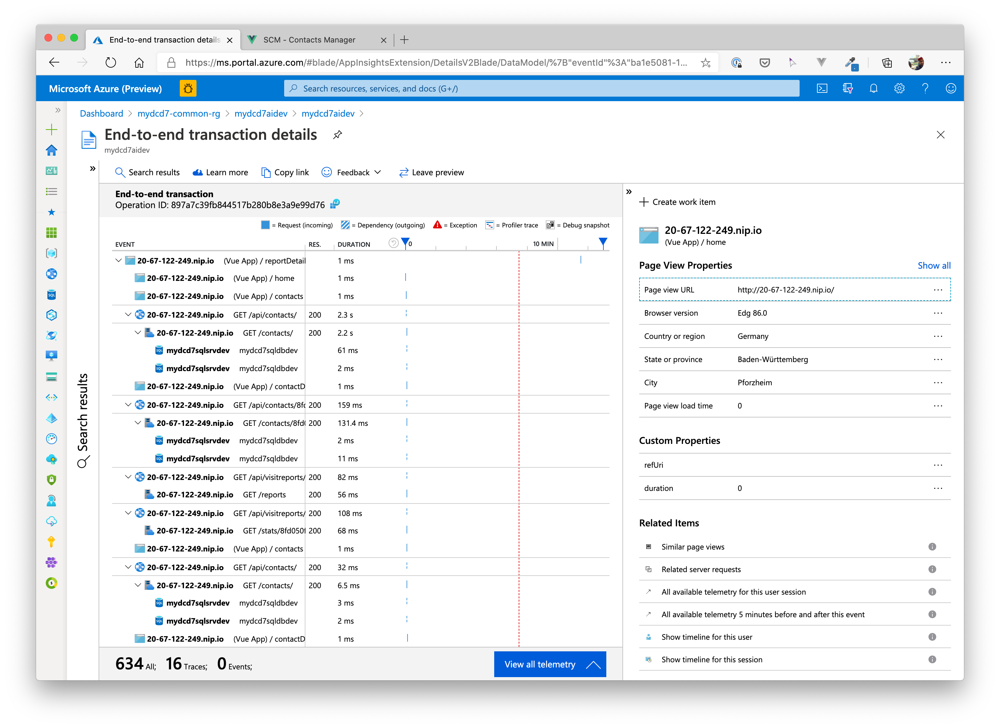

## Kubernetes Insights

If you are not familiar with the `kubectl` command line tool and like a more UI-oriented approach to investigate things, then you might find the Azure Portal useful to gain some insights for your cluster.

Navigate to the cluster you jsut created in the portal and have a look at the context menu at the left side. Under `Kubernetes resources` you find entries for `Namespaces`, `Workloads`, `Services and ingress` etc. Click through each of the menu items and have a look at the information the views provide, espacially the `Workloads` view is interesting, as it shows Kubernetes deployments, pods, replicasets etc.

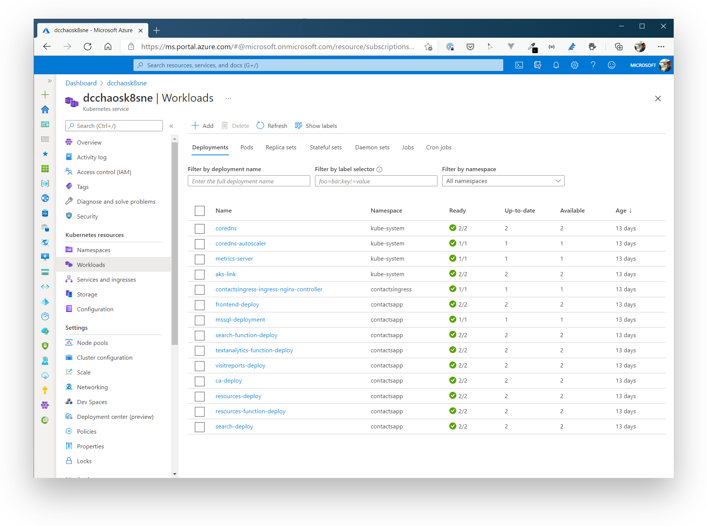

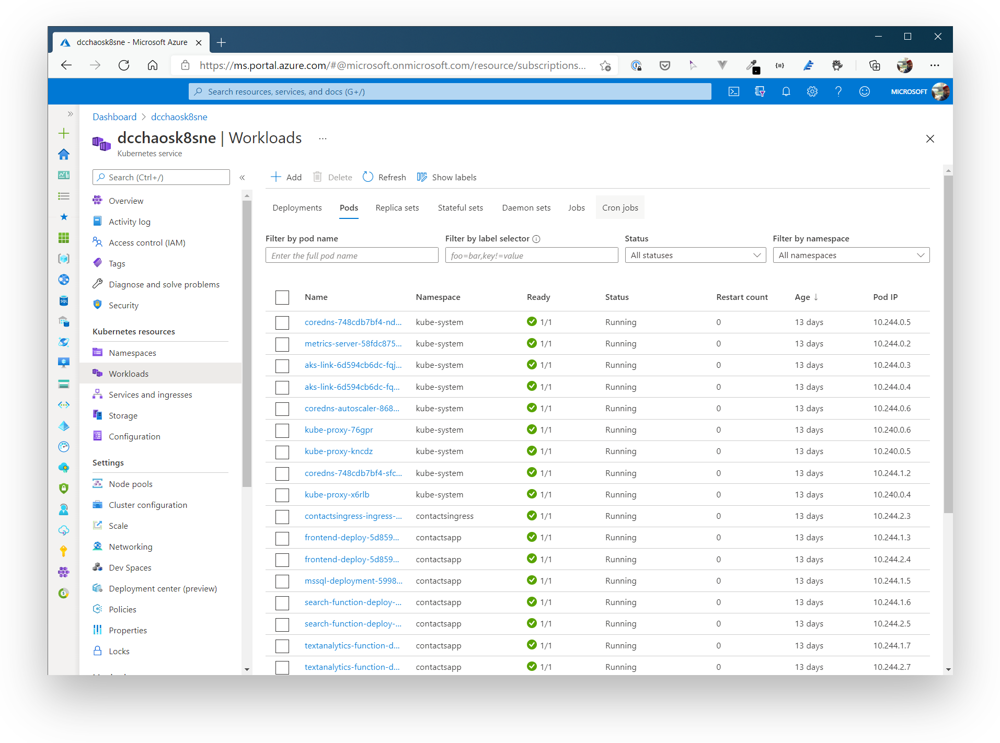

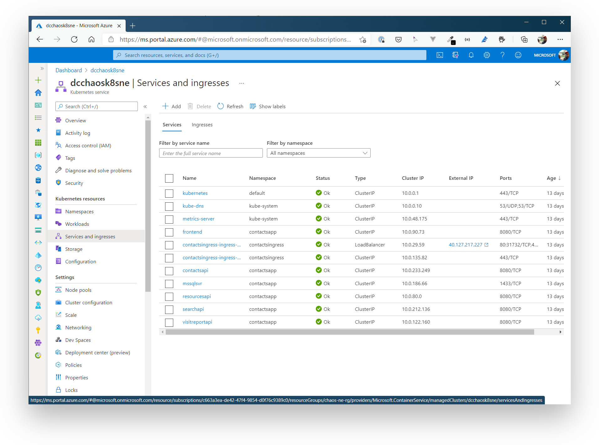