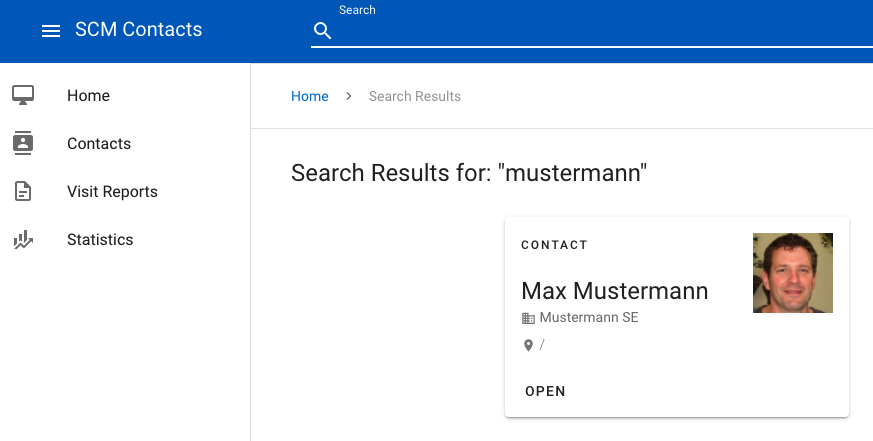

# Challenge 1 - Chaos Engineering "hello world"

## Introduction

Our first challenge is the Kubernetes “hello world” of Chaos Testing. What happens if the contact service fails? The Search Service from our demo application takes all search requests for contacts, searches in Azure Cognitive Search, and returns the results as a JSON response. The web UI communicates directly with this service.

## Step #1: Get to know the demo app



* Open the demo app in the browser (see [Smoke Test](../challenge-0#smoke-test)) and create a few test contacts.
* Run a few searches using the search box. 
* Run the search directly in the cloud shell

```shell
export APP=<NIP_HOSTNAME>

curl http://$APP/api/search/contacts?phrase=mustermann
```

If you want to format the JSON response, you can use the JSON processor (`jp`) to do so:

```shell
curl http://$APP/api/search/contacts?phrase=mustermann | jq '.'
```

## Step #2: Game Day

Now we start with our first experiment. Admittedly, it is a bit naive. But the first task is about the process and tooling. Not about the complexity of the experiment. In this step, we do not yet use Chaos Test Tooling. We use only `kubectl` at first. This is exactly how one would proceed on a Game Day. You set up a hypothesis with your colleagues and design an experiment based on it. 

|                       |                              |
|-----------------------|------------------------------|
| Target                | Search Service               |
| Experiment            | Service failure is simulated |
| Hypothesis            | Kubernetes detects the failure of a pod in real-time and immediately starts a new instance. There is only a downtime < 1 second. |
| Steady State          | The Search Service responds with HTTP Response Code 200 and an average response time of less than 200ms. |
| Blast Radius          | The experiment involves only the Search Service. The Contact App UI and all use cases (except Search Service) are fully available. |
| Technical information | We simulate the failure by directly terminating a Search Service pod instance |

Let's do the experiment. 

```shell
kubectl delete pods --force --grace-period=0 -l service=searchapi && \
    sleep 1 && \
    curl http://$APP/api/search/contacts?phrase=mustermann

<html>
<head><title>503 Service Temporarily Unavailable</title></head>
<body>
<center><h1>503 Service Temporarily Unavailable</h1></center>
<hr><center>nginx</center>
</body>
</html>
```

Our experiment fails. One second after killing the pod, the ingress returns an HTTP 503 error. The Search Service is not available again for another 4-5 seconds. We want to prevent this and run the experiment again with Chaos Toolkit.

## Step #3: Chaos Toolkit

### Install Chaos Toolkit and Kubernetes extention

```shell
pip install chaostoolkit
pip install chaostoolkit-kubernetes
```

Let's check the first [experiment](kill-search-pod.yaml):

The first part contains the meta data and the configuration block with our `APP` environment variable.

```yaml
version: 1.0.0
title: Validate search service outage
description: Kills search service and validates search api availability

# define azure properties
configuration:
  app:
    type: "env"
    key: "APP"
```

The second part is the experiment's `steady-state`.

```yaml
# define the steady state hypothesis
steady-state-hypothesis:
  title: Verifying search api remains healthy
  probes:
  - type: probe
    name: search-api-must-still-respond
    tolerance: 200 # http response code 200 is expected
    provider:
      type: http
      url: http://${app}/api/search/contacts?phrase=mustermann
      timeout: 0.2
```

The third part is the experiment's action: Our solution uses the Kubernetes driver extension and terminates exactly one pod from the “contactsapp” namespace of all deployments with the label `service=searchapi`. The driver uses your current kubectl context (~/.kube/config).

```yaml
# define the experiment's action
method:
- type: action
  name: terminate-pod
  provider:
    type: python
    module: chaosk8s.pod.actions
    func: terminate_pods
    # Terminates one "searchapi" pod randomly
    arguments:
      label_selector: service=searchapi
      ns: contactsapp
      qty: 1
      rand: true
      grace_period: 0
  pauses:
    after: 1
```

Now we know our experiment. We can easily run it in the Cloud Shell console.

```shell
$ chaos run challenges/challenge-1/kill-search-pod.yaml
```

Like our first Game Day test with `kubectl` and `curl`, this test fails. Restarting the pod takes too long. As a simple solution, we now increase the number of replicas of the Search Service deployment to 2.

```shell
$ kubectl scale --replicas=2 deployment/search-deploy
```

After this change, we can run our experiment again.

```shell
$ chaos run challenges/challenge-1/kill-search-pod.yaml
```

The experiment is now successful. After the action, the rules of `steady-state` are still followed.

```shell
[2021-03-08 14:59:23 INFO] Validating the experiment's syntax
[2021-03-08 14:59:26 INFO] Experiment looks valid
[2021-03-08 14:59:26 INFO] Running experiment: Validate search service outage
[2021-03-08 14:59:26 INFO] Steady-state strategy: default
[2021-03-08 14:59:26 INFO] Rollbacks strategy: default
[2021-03-08 14:59:26 INFO] Steady state hypothesis: Verifying search api remains healthy
[2021-03-08 14:59:26 INFO] Probe: search-api-must-still-respond
[2021-03-08 14:59:27 INFO] Steady state hypothesis is met!
[2021-03-08 14:59:27 INFO] Playing your experiment's method now...
[2021-03-08 14:59:27 INFO] Action: terminate-pod
[2021-03-08 14:59:27 INFO] Pausing after activity for 1s...
[2021-03-08 14:59:28 INFO] Steady state hypothesis: Verifying search api remains healthy
[2021-03-08 14:59:28 INFO] Probe: search-api-must-still-respond
[2021-03-08 14:59:29 INFO] Steady state hypothesis is met!
[2021-03-08 14:59:29 INFO] Let's rollback...
[2021-03-08 14:59:29 INFO] No declared rollbacks, let's move on.
[2021-03-08 14:59:29 INFO] Experiment ended with status: completed
```

Congratulations. You have successfully completed the first challenge. You have discovered the workflow of Chaos Toolkit and the Kubernetes extention. Let's continue with [challenge #2](../challenge-2/README.md).
