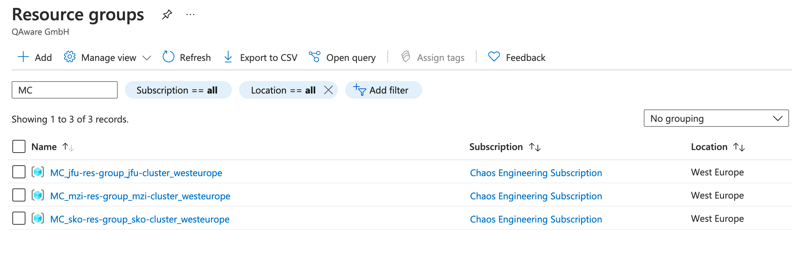
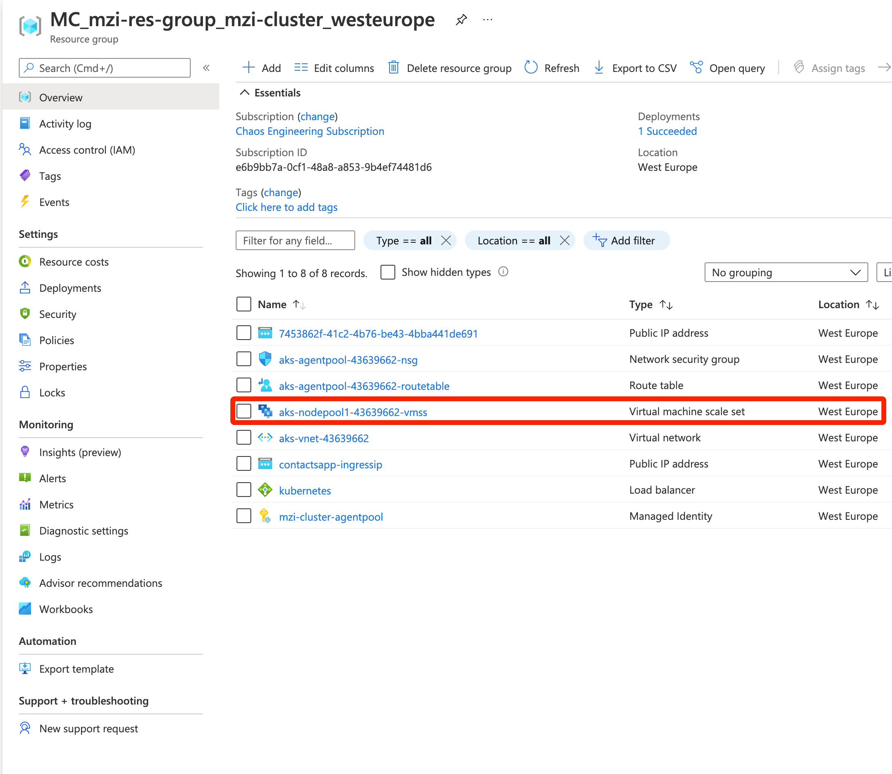
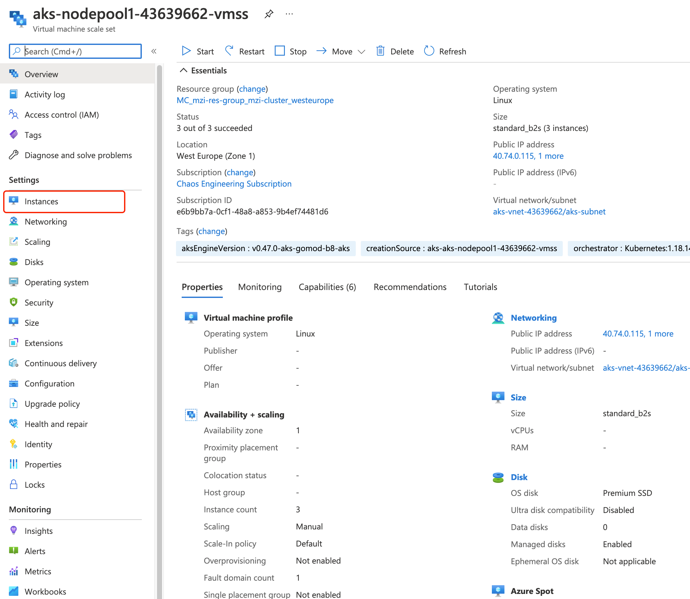
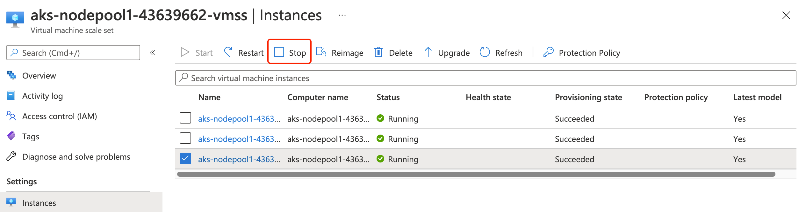

# Challenge 2 - Spread your application over the whole cluster

In this section, we will get in touch with the Azure Extension of Chaos Toolkit. With this extension, we can create chaos on the Kubernetes nodes by directly interacting with the Azure resources which power the cluster. 

We will answer the following questions during this challenge:
- What happens to our application, when one node is done? 
- How do we make the application more resilient to node failures?

## Prerequisites

### Create a service principal to interact with the Azure API

The Azure extension of chaos-toolkit interacts with the Azure API using a service principal. We need to create it first and store the credentials in a file which we will be read by chaos-toolkit.

Run the following command to create the service principal:
```shell
az ad sp create-for-rbac --sdk-auth > credentials.json
```

Before executing a command with chaos-toolkit, reference the credentials like this:
```shell
export AZURE_AUTH_LOCATION=credentials.json
```

### Install Azure extension for chaos-toolkit

_TODO: reference virtual env created in challenge 1 here_
To install the Azure extension, run the following commands:
```shell
pip install -U chaostoolkit-azure

# Due to chaostoolkit-azure no pinning old library versions that depend on, we need to install them manually:
pip install azure-mgmt-resourcegraph==2.0.0
pip install azure.mgmt.compute==7.0.0
```

## Pod distribution over nodes
In the previous challenge, we increased the replica amount of the frontend deployment to 2 replicas. This makes our frontend highly available and protects us from sudden pod failures. If one pod fails, there will always be a at least one more to answer requests.

But what about node failures? If all pods of multiple applications or all pods of an application are on the same node and that node fails, we have a outage of our applications. While Kubernetes will quickly spin up new pods when a node is suddenly removed, the application startup will determine our downtime. 

It is important to know how the pods are distributed over the cluster. Check for all services on which nodes the pod instances are running.  

You can do this either by checking the Kubernetes dashboard inside the Azure Portal or by using kubectl. Let's try this out with kubectl:

You can run `kubectl get nodes` to see how many nodes are currently running in the cluster.
For example:
```shell
$ kubectl get nodes
NAME                                STATUS   ROLES   AGE   VERSION
aks-nodepool1-36421985-vmss000000   Ready    agent   27d   v1.18.14
aks-nodepool1-36421985-vmss000009   Ready    agent   16d   v1.18.14
aks-nodepool1-36421985-vmss00000a   Ready    agent   16d   v1.18.14
```

Let's see how the different application pods are distributed over the cluster. We use the parameter `-o wide` with `kubectl get pods` in the application namespace `contactsapp` to display the node on which the pod is running:
```shell
$ kubectl get pods -n contactsapp -o wide
NAME                                             READY   STATUS    RESTARTS   AGE     IP             NODE     NOMINATED NODE   READINESS GATES
ca-deploy-7d6855964c-sn7wm                       1/1     Running   0          3d19h   10.244.7.18    aks-nodepool1-36421985-vmss00000a   <none>           <none>
frontend-deploy-5d85979b7b-m4cjx                 1/1     Running   0          16d     10.244.6.6     aks-nodepool1-36421985-vmss000009   <none>           <none>
mssql-deployment-5998699cd8-9rpx5                1/1     Running   0          16d     10.244.6.13    aks-nodepool1-36421985-vmss000009   <none>           <none>
resources-deploy-7f5f968587-ql2bg                1/1     Running   0          3d19h   10.244.7.19    aks-nodepool1-36421985-vmss00000a   <none>           <none>
resources-function-deploy-58744cb66-tlvrh        1/1     Running   0          3d19h   10.244.7.16    aks-nodepool1-36421985-vmss00000a   <none>           <none>
search-deploy-88bd76564-6s9dh                    1/1     Running   0          3d19h   10.244.2.223   aks-nodepool1-36421985-vmss000000   <none>           <none>
search-deploy-88bd76564-744xn                    1/1     Running   0          3d19h   10.244.2.222   aks-nodepool1-36421985-vmss000000   <none>           <none>
search-function-deploy-84b4b6bc84-sdxdr          1/1     Running   0          3d19h   10.244.7.17    aks-nodepool1-36421985-vmss00000a   <none>           <none>
textanalytics-function-deploy-6bc56f6b8c-jxqsk   1/1     Running   0          3d19h   10.244.7.20    aks-nodepool1-36421985-vmss00000a   <none>           <none>
visitreports-deploy-5fc8bf9cf5-gfv9r             1/1     Running   1          16d     10.244.6.8     aks-nodepool1-36421985-vmss000009   <none>           <none>
```
Now that we know, how the pods are distributed over the nodes, this will help us with monitoring the application health during node failures. 

## Experiment with node failures
We will now try out what happens with our application when we stop one of the nodes of our cluster. 

### Stop one node manually
Let's first do this manually.

First select the resource group of your AKS cluster. You can find it by selecting *Resource groups* in the Azure Portal.
_TODO: add Images from Azure Portal_
Select the resource groups with the name `MC_<resource-group of your cluster>_<cluster_name>_<location>`. This contains the underlying Azure resources of your AKS cluster. 
You can also type in the prefix `MC` in the search to see the resource group faster as in the following image:


Now, select the Virtual machine scale set of your cluster. There should be only one in this resource group.


Select *Instances* in the left sidebar to view all instances of the scale set. 


Finally, you can select one of the instances to stop. Select one by ticking the box on left and then select *Stop* in the top bar. 


When you stopped one, monitor your application health status and the node status.

You can check the nodes of your cluster by using the kubectl command from before `kubectl get nodes`
For example:
```shell
$ kubectl get nodes
NAME                                STATUS   ROLES   AGE   VERSION
aks-nodepool1-36421985-vmss000000   Ready    agent   27d   v1.18.14
aks-nodepool1-36421985-vmss000009   Ready    agent   16d   v1.18.14
aks-nodepool1-36421985-vmss00000a   Ready    agent   16d   v1.18.14
```
Tip: add a `watch` in front of the command to see live updates of your nodes. 

At some point one of the nodes is *NotReady*. 
How long does it take, until Kubernetes registers this? How does this influence our monitoring or testing of the Kubernetes health state?

Check if your application still works normally.
Do this by going to the web application using the previous variable `nip_hostname` from Terraform and click through the app. Does every menu still respond normally?

You can also view if enough pods are still alive using `kubectl get pods -n contactsapp` in the namespace of the application. If your application is down - how long does it take to recover? 

Take these learnings into account, when creating a chaos experiment in the next part of the challenge.
### Create a chaos experiment using chaostoolkit
Now, let's define a chaos experiment to test our application against node failures. We will stop a specific node and validate that the application still works. Exactly what we did manually in the previous section.

#### Create the experiment definition 
We again start by creating an empty experiment definition called `stop-node.yaml`.
Add the necessary metadata and configuration to the file:
```yaml
---
version: 1.0.0
title: Validate pod distribution over k8s nodes
description: Stops k8s node of VM scale set and validates application availability

# define azure properties
configuration:
  azure_subscription_id:
    type: "env"
    key: "AZURE_SUBSCRIPTION_ID"
  azure_resource_group: 
    type: "env"
    key: "AZURE_CLUSTER_RESOURCE_GROUP"
  azure_vmss_name: 
    type: "env"
    key: "AZURE_CLUSTER_RESOURCE_GROUP" 
  azure_vmss_instanceId:
    type: "env"
    key: "AZURE_CLUSTER_VMSS_INSTANCE0"
  azure_app_endpoint: 
    type: "env"
    key: "APP_ENDPOINT"
```

After adding metadata and configuration, we should first add the hypothesis. This is validating that the whole application still works. It's similar to looking manually whether the application still works.
What components do we need to verify?
Let's remember the architecture of our SCM application. 
We have the following important components:
- Frontend
- Contacts API
- Visit Reports API
- Search API

For each of these components, we need to verify that the endpoint is still responding successfully.
We add the following probes under the `steady-state-hypothesis`:
```yaml
steady-state-hypothesis:
  title: Verifying application is still healthy
  probes:
  - type: probe
    name: search-api-must-still-respond
    tolerance: 200 # http response code 200 is expected
    provider:
      type: http
      timeout: 2
      url: http://${azure_app_endpoint}/api/search/contacts?phrase=mustermann
  - type: probe
    name: contacts-api-must-still-respond
    tolerance: 200 # http response code 200 is expected
    provider:
      type: http
      timeout: 2
      url: http://${azure_app_endpoint}/api/contacts/
  - type: probe
    name: visitreports-api-must-still-respond
    tolerance: 200 # http response code 200 is expected
    provider:
      type: http
      timeout: 2
      url: http://${azure_app_endpoint}/api/visitreports/reports
  - type: probe
    name: frontend-must-still-respond
    tolerance: 200 # http response code 200 is expected
    provider:
      type: http
      timeout: 2
      url: http://${azure_app_endpoint}/
```
How did we get these urls?
You can find these API endpoints, using the web application and checking what requests are made against the backend. For example in Chrome, you can open the Network tab in the developer tools to see the requests. 


Now that we have our hypothesis finished, we can create the chaos. We want to stop a node in our cluster virtual machine scale set. So, we look at the documentation of the chaostoolkit Azure plugin and search for virtual machine scale sets. There we find that we need to use the module `chaosazure.vmss.actions` with the action `stop_vmsss`. Also, we need to select the right virtual machine scale set using a filter. Putting this all together, we get the following action definition:

```yaml
method:
- type: action
  name: stop-instance
  provider:
    type: python
    module: chaosazure.vmss.actions
    func: stop_vmss
    arguments:
      filter: where resourceGroup=~'${azure_resource_group}' and name=~'${azure_vmss_name}'
      instance_criteria:
      - name: ${azure_vmss_instanceId}
  pauses:
    after: 15
```
This will stop the by the configuration specified Instance in our cluster virtual machine scale set. Also, we add a pause of 15 seconds before executing the validation of our hypothesis. This is due to some execution time needed to stop the node and Kubernetes to realize that the node is down.

Every chaos experiment should also always include a rollback. We restart the node at the end, so that the cluster is healthy again after the experiment is finished. For that, we need the `restart_vmss` action from the `chaosazure.vmss.actions`. The filter needs to select the same instance we stopped before. 
Putting it together:

```yaml
# define rollback: restart k8s node
rollbacks:
- type: action
  name: restart-instance
  provider:
    type: python
    module: chaosazure.vmss.actions
    func: restart_vmss
    arguments:
      filter: where resourceGroup=~'${azure_resource_group}' and name=~'${azure_vmss_name}'
      instance_criteria:
      - name: ${azure_vmss_instanceId}
```
This will restart the instance we stopped before.

With the hypothesis, chaos method and rollback definitions complete, we are finished with the experiment and can run it.

You can also find the full experiment definition in `samples/stop-node.yaml`.

#### Run the experiment
After finishing the experiment definition, let's run it against the cluster.
To retrieve the necessary resource ids for our experiment, execute the following commands:
```shell
AZURE_CLUSTER_RESOURCE_GROUP=$(az aks show -n <CLUSTER_NAME> -g <CLUSTER_RES_GROUP> --query "nodeResourceGroup" -o tsv)
AZURE_CLUSTER_VMSS_NAME=$(az vmss list -g $AZURE_CLUSTER_RESOURCE_GROUP --query [0].name -o tsv)
AZURE_CLUSTER_VMSS_INSTANCE0=$(az vmss list-instances -n $AZURE_CLUSTER_VMSS_NAME -g $AZURE_CLUSTER_RESOURCE_GROUP --query [0].name -o tsv)
```

Note that the variable `AZURE_CLUSTER_VMSS_INSTANCE0` selects the first node in the scale set. When you want to stop a different node, you need to change the number in the query string `--query [0].name`. 

Do not forget to reference the Azure credentials like follows:
```shell
export AZURE_AUTH_LOCATION=credentials.json
```
Now run the chaos experiment with:
```shell
chaos run ./stop-node.yaml
```
_TODO: add sample output of experiment here_


#### Experiment results
What was your result of the experiment? Did the application still work? 

Try re-running the experiment again using a different instance to see if you get a different result.
The expected behavior would be that the application fails at least once during one run of your experiment. 
What is the cause for the application failure?

When the node fails, and all pod instances are running on that node, the application will be unavailable. In such a case, your app is not distributed well over the cluster. 
Another case could be pods of different application services sitting on the same node and that node fails. Even though, one of the services might have multiple pods, your application is still not fully accessible because one component is not available.

Let's find out in the next section, how we can build our deployments more resilient against node failures.
## Spread pods over multiple nodes
We learned from the experiment that we need to spread our application pods over all nodes to have high availability and resiliency against node failures. 
Now what can we do to avoid such issues?

There are two solutions:
1. Increase replicas for all applications
2. Add Inter-Pod AntiAffinities to force pods on different nodes

### Increase replicas for all applications
One quick solution is increasing the replicas for all applications. This increases the chance of application pods getting spread over nodes when there is enough capacity on the nodes.

To increase the amount of replicas, we only need to change the `spec.replicas` property in our Kubernetes deployments. You can find the Kubernetes manifests for our "Simple Contacts Management" application under `apps/manifests`. 
Change the replicas property value for all deployments (all ending with suffix `-deployment`) to at least 2. Leave out the mssql-server as we moved it to an managed Azure database. 

The deployment yaml then looks like this, for example for visitreport-api-deployment.yaml:
```yaml
apiVersion: apps/v1
kind: Deployment
metadata:
  name: visitreports-deploy
  namespace: contactsapp
  labels:
    application: scmcontacts
    service: visitreportsapi
spec:
  replicas: 2
  strategy:
    type: RollingUpdate
    rollingUpdate:
      maxSurge: 1
      maxUnavailable: 1
  minReadySeconds: 5
  revisionHistoryLimit: 3
  selector:
    matchLabels:
      application: scmcontacts
      service: visitreportsapi
  template:
    ...
```

Under `samples/manifests/multi_replica` you can find all deployments with the replica property already modified. Just copy them into the original manifests folder `apps/manifests` to continue.

Redeploy the Kubernetes manifests using Terraform.
Run the following command in the `terraform` folder:
```shell
$ terraform apply \
  -var="prefix=<yourprefix>" \
  -var="location=westeurope" \
  -var="aks_resource_group_name=<ResourceGroupName>" \
  -var="akscluster=<ClusterName>"
```

Now check again with `kubectl get pods -n contactsapp` if there are multiple pods for each deployment. 
Example output:
_TODO: add output when having multiple replicas_

You should see multiple pods per deployment. Also, check that the pod instances are really running on different nodes.

Now try to redo the experiment - it should not fail anymore except when the scheduler by accident put the additional replicas on the same node. The next section shows you what you can do to prevent such cases.

### Add Inter-Pod AntiAffinities to all deployments
To be extra sure, we can add Pod AntiAffinity to tell the scheduler to always spread the pods over multiple nodes.
This can also be used to prevent application services being co-located on the same node.

For this challenge we will focus on creating Anti-Affinity rules to make sure two pods of one deployment cannot be on the same node. 
The idea is to require the scheduler to schedule pods matching a specified label to distinct nodes. To differentiate the nodes, labels on the nodes are used.
In our case, we will use the *service* label to match pods and the label *kubernetes.io/hostname* to match nodes.

A Pod Anti-Affinity needs to be added to the deployment spec of each application deployment.
As an example we will now add such an affinity to the *contacts-api*.

```yaml
apiVersion: apps/v1
kind: Deployment
metadata:
  name: ca-deploy
  namespace: contactsapp
  labels:
    application: scmcontacts
    service: contactsapi
spec:
  ...
  template:
    metadata:
      labels:
        application: scmcontacts
        service: contactsapi
    spec:
      affinity:
        podAntiAffinity:
          requiredDuringSchedulingIgnoredDuringExecution:
          - labelSelector:
              matchExpressions:
              - key: service
                operator: In
                values:
                - contactsapi
            topologyKey: "kubernetes.io/hostname"
    ...
```
We select the pods using the `labelSelector` matchExpressions by specifiying the key `service` to match to the value `contactsapi`. This selects all *contactsapi* pods. By giving the topologyKey `kubernetes.io/hostname` we ensure that each *contactsapi* replica does not co-locate on a single node. This is due to each node having a different *hostname*. With this method, we could also map pods to multiple node types or pools. 

Now continue adding the these Pod Anti-Affinities to the other deployments. Under `samples/manifests/anti_affinity` you can find all deployments with Anti-Affinity rules added. Just copy them into the original manifests folder `apps/manifests` to continue. 
Redeploy the manifests with Terraform again using the following command:

```shell
$ terraform apply \
  -var="prefix=<yourprefix>" \
  -var="location=westeurope" \
  -var="aks_resource_group_name=<ResourceGroupName>" \
  -var="akscluster=<ClusterName>"
```

Now observe again how the pods are distributed over the nodes. Can you see that the scheduler never puts both replicas on two nodes?

If you have some time left, you can also retry the experiment for a last time to see if it still can fail.