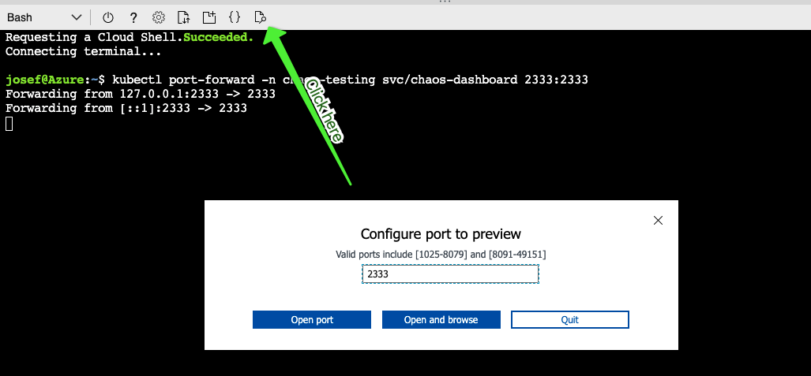

# Challenge 3 - Stability also in case of network troubles

## Introduction

## Installation

```shell
$ curl -sSL https://mirrors.chaos-mesh.org/v1.1.2/install.sh | bash
```

### Verify your installation

Verify if Chaos Mesh is running

```shell
kubectl get pod -n chaos-testing
```

Expected output:

```shell
NAME                                        READY   STATUS    RESTARTS   AGE
chaos-controller-manager-594f96f9dc-r8b5h   1/1     Running   0          3m14s
chaos-daemon-plkhb                          1/1     Running   0          3m14s
chaos-daemon-x7rcj                          1/1     Running   0          3m14s
chaos-daemon-zgl2x                          1/1     Running   0          3m14s
chaos-dashboard-59b6ffcbb5-n8bkz            1/1     Running   0          3m14s
```

### Access Chaos Dashboard

```shell
kubectl port-forward -n chaos-testing svc/chaos-dashboard 2333:2333
```

