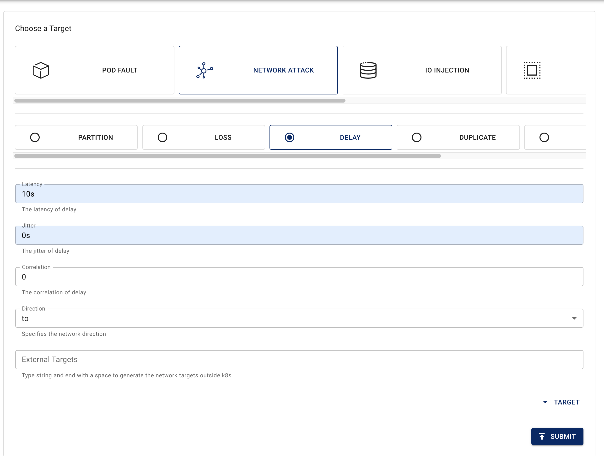
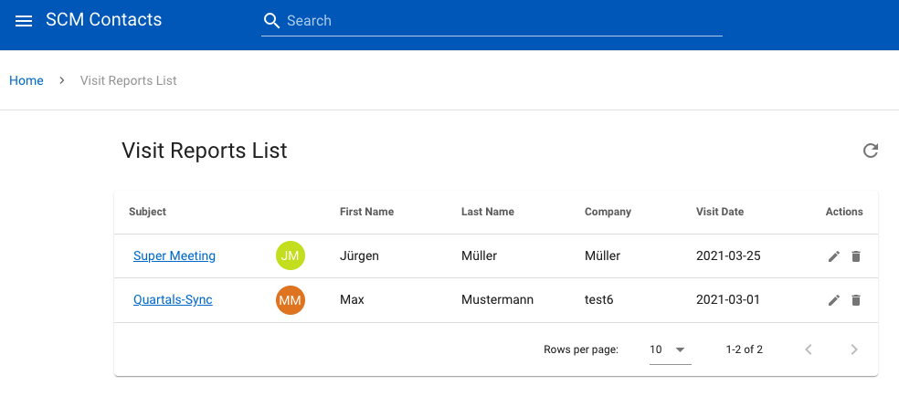
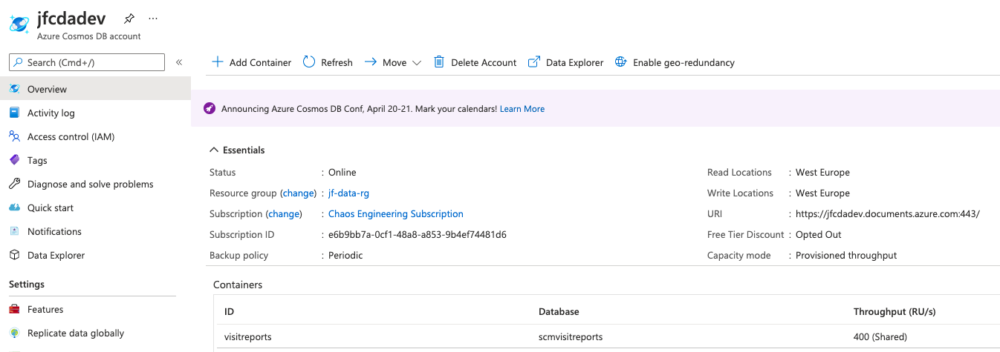
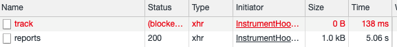
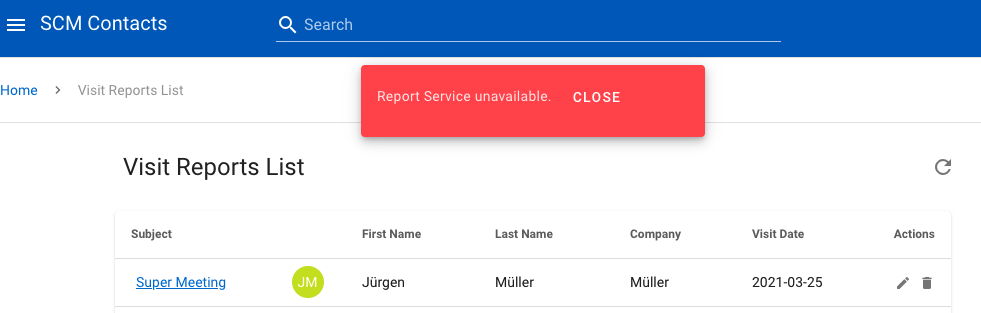

# Challenge 3 - Stability also in case of network troubles

## Introduction

## Installation

```shell
$ curl -sSL https://mirrors.chaos-mesh.org/v1.1.2/install.sh | bash
```

> Disclamer: We have checked the `install.sh` file and we are in a training sandbox. Please do not install unknown Kubernetes resources into your clusters.

### Verify your installation

Verify if Chaos Mesh is running

```shell
kubectl get pod -n chaos-testing
```

Expected output:

```shell
NAME                                        READY   STATUS    RESTARTS   AGE
chaos-controller-manager-594f96f9dc-r8b5h   1/1     Running   0          3m14s
chaos-daemon-plkhb                          1/1     Running   0          3m14s
chaos-daemon-x7rcj                          1/1     Running   0          3m14s
chaos-daemon-zgl2x                          1/1     Running   0          3m14s
chaos-dashboard-59b6ffcbb5-n8bkz            1/1     Running   0          3m14s
```

### Access Chaos Dashboard

Open your browser with your `nip_hostname`: `http://<nip_hostname>/dashboard`.

> Attention: To simplify things, we have dispensed with authentication for the workshop. If you want to run the Chaos Mesh Dashboard publicly on the Internet, you have to take care of an [authentication](https://chaos-mesh.org/docs/user_guides/dashboard#log-in).


## Easy chaos with the chaos-mesh dashboard

Now that we have the chaos-mesh dashboard ready, we can start with creating chaos experiments.

This time, we want to test our application against network issues. We will start simple, by looking at how the frontend reacts to network delays. 
This first experiment is mainly there to show you the dashboard and the impact of network delays on the frontend are quickly visible. 

On the dashboard, you can see multiple menus. Click on *New Experiment*.


This opens the experiment configuration. Select as Target *Network Attack*. 


Here, we can choose between different network attacks. For explanations on each possible attack, look at the [Chaos-Mesh Documentation about Network Chaos](https://chaos-mesh.org/docs/chaos_experiments/networkchaos_experiment). We will choose for *Delay* and set up some example values like a very high delay of *10s*. We keep Jitter and Correlation for now at zero and set the direction as *to*. This means, all network traffic to the selected Pods is affected. If we set no target here, then all traffic of the selected Pods is affected, regardless of incoming and outgoing. With direction `from` or `both`, we can filter the targets which have issues connecting to the selected pods (only for cluster pods). With external target, one can set the external targets which cannot be accessed anymore in combination with the direction `to`. After setting these values, click on Submit and continue.  



Now, we choose the pods which are targeted by this attack. We decided to start with the frontend. First, pick the namespace `contactsapp`. This selects all pods in that namespace. Then, choose the label that distinguishes frontend pods from other pods, which is `service: frontend`. You can see that in the *Affected Pods Preview* only the two frontend pods are selected now. Now, choose a name for the experiment, in our example `network-delay-frontend`. Finally, you can pick a schedule how often your experiment should run. Because, we want to see a direct impact, we choose `Run continuously`. After clicking two times on Submit, the experiment begins...  


Let's see, if the SCM application still responds fast. Go to the url from before or if you forgot run `cd terraform; terraform output -raw nip_hostname` in the repository folder. You should directly see a difference, the applications seems to take ages to load. Our experiment works as expected. You can also open the Devtools in your browser, to see in the Network tab how long it takes. 


Your first Chaos-Mesh experiment was successful, but clicking every experiment through the dashboard is not the best solution for multiple experiments. Similar to chaostoolkit, you can define experiments as yaml. Chaos-Mesh even built their own Kubernetes custom resources for that. 

Click on the left sidebar of the Chaos-Mesh dashboard on *Experiments*  and select the experiment we defined earlier. You should see the following view of the running experiment:

 

Here, you can download the experiment definition as yaml by clicking on *Download*. 

The downloaded experiment definition should look like this: 

```yaml
apiVersion: chaos-mesh.org/v1alpha1
kind: NetworkChaos
metadata:
  name: network-delay-frontend
  namespace: contactsapp
  labels: null
  annotations: null
spec:
  action: delay
  mode: one
  value: ''
  selector:
    namespaces:
      - contactsapp
    labelSelectors:
      service: frontend
  delay:
    latency: 10s
    correlation: '0'
    jitter: 0s
  direction: to
```

How is this experiment definition structured? First, we see that the kind is `NetworkChaos`, the different experiment types each have different kinds and as such are different custom resources. In the [Chaos-Mesh documentation](https://chaos-mesh.org/docs), you can see all possible experiment types and a detailed description of the possible attack actions for each type. Like other Kubernetes resources, we have a `metatadata` block, specifying *name*, *namespace* and *labels* for the resource. In the spec, we have all the settings we configured in the dashboard. The attack action is defined with the concrete settings under `delay`. Direction is also set. The `selector` block specifies which pods should be targeted by the attack.  

We see that it is not so difficult to define experiments as code. 
 
These chaos experiment resources are deployed to your cluster like any other Kubernetes resource.

You can check, if our experiment from before is running in the cluster using the following command:

```bash
$ kubectl get networkchaos -n contactsapp
NAME                     AGE
network-delay-frontend   7m23s
```

Now you can use the same commands in `kubectl` to modify the experiment, apply changes or delete it.

To stop the experiment, you can either click on *Archive* in the dashboard on the experiment view or run `kubectl delete networkchaos -n contactsapp network-delay-frontend`. After that, the experiment is stopped and the SCM application is responding fast again.

## External chaos - configure network delay to an Azure service

Many of our applications have external dependencies. No matter how good we can build everything in our cluster, there still can be delay or failure to an external service. We should still build our applications resilient enough with timeouts and retries to survive such issues.

Let's built a chaos experiment to test the SCM application against delays in their external dependencies. We pick the connection between the SCM Visit Report API service and the Azure Cosmos DB. Here, we want to introduce a network delay on that connection similar to the experiment in the previous section.

We start with creating some test data. Open the "Visit Reports" page of our demo application and add two new visit reports with the green "+" button in the bottom left corner.



We start with finding out the external URL of the Azure Cosmos DB. To do this, we go to the Azure Portal and look for the deployed Azure Cosmos DB. You can use the search bar, search for the keyword `cosmos` and select your Azure Cosmos DB instance. 
The name of the Azure Search service should be `<your-prefix>cdadev`. If you selected the service, you can find the URL in the overview. 


This url is what we will use as *External Target* in our experiment.
Now, we can define the chaos experiment. We will do this directly as yaml: `network-delay-visitreport.yaml`

```yaml
apiVersion: chaos-mesh.org/v1alpha1
kind: NetworkChaos
metadata:
  name: network-delay-visitreport
  namespace: contactsapp
  labels: null
  annotations:
    experiment.chaos-mesh.org/pause: 'false'
spec:
  action: delay
  mode: all
  value: ''
  selector:
    namespaces:
      - contactsapp
    labelSelectors:
      service: visitreportsapi
  delay:
    latency: 5s
    correlation: '0'
    jitter: 0ms
  direction: to
  externalTargets:
    - <your-prefix>cdadev.documents.azure.com
    - <your-prefix>cdadev-westeurope.documents.azure.com
```

We define the delay with 5s latency. The selector now points to the `visitreportsapi` service. Important to change mode from `one` to `all` so that the chaos experiment picks all `visitreportsapi` pods as we are running them with two replicas. 
Finally, we define the external target which is the Cosmos DB. 
With this definition, only the traffic to the Cosmos DB is delayed.

We can now deploy the experiment using `kubectl apply -f network-delay-visitreport.yaml`. After deployment, the experiment directly starts.

For the visit reports service we have prepared a small `k6` performance test. Change to the "k6" directory and run the test.

```bash
$ ./k6 run ./reports.js
```

Result:

```
running (16.0s), 0/1 VUs, 3 complete and 0 interrupted iterations
default ✓ [======================================] 1 VUs  15s

     ✓ response code was 200

     checks.........................: 100.00% ✓ 3   ✗ 0
     data_received..................: 2.4 kB  152 B/s
     data_sent......................: 333 B   20 B/s
     http_req_blocked...............: avg=15.39ms  min=12µs  med=13µs  max=46.16ms p(90)=36.93ms p(95)=41.54ms
     http_req_connecting............: avg=14.91ms  min=0s    med=0s    max=44.75ms p(90)=35.8ms  p(95)=40.28ms
   ✓ http_req_duration..............: avg=5.06s    min=5.05s med=5.06s max=5.06s   p(90)=5.06s   p(95)=5.06s
       { expected_response:true }...: avg=5.06s    min=5.05s med=5.06s max=5.06s   p(90)=5.06s   p(95)=5.06s
     http_req_failed................: 0.00%   ✓ 0   ✗ 3
     http_req_receiving.............: avg=236µs    min=156µs med=201µs max=351µs   p(90)=321µs   p(95)=335.99µs
     http_req_sending...............: avg=163.99µs min=57µs  med=88µs  max=347µs   p(90)=295.2µs p(95)=321.09µs
     http_req_tls_handshaking.......: avg=0s       min=0s    med=0s    max=0s      p(90)=0s      p(95)=0s
     http_req_waiting...............: avg=5.06s    min=5.05s med=5.05s max=5.06s   p(90)=5.06s   p(95)=5.06s
     http_reqs......................: 3       0.187608/s
     iteration_duration.............: avg=5.32s    min=5.31s med=5.32s max=5.35s   p(90)=5.35s   p(95)=5.35s
     iterations.....................: 3       0.187608/s
     vus............................: 1       min=1 max=1
     vus_max........................: 1       min=1 max=1
```

The test should run successfully. The test runs for 15 seconds and runs the "Visit Report" service again and again. The test validates whether all responses have the status code 200 and average request duration (`sending + waiting + receiving`) is below 5.5 seconds. 

Let's take a look what our application does. Open the Visit Reports page. In the Browser Dev Tools you can see the slower loading time of the service.



The final task of this challenge is now to figure out by how much the delay needs to be increased so that the list loading fails and displays an error message in the "Visit Reports" dialog? To do this, increase the `latency` parameter in the `network-delay-visitreport.yaml` file step by step and apply each change to the experiment: `kubectl apply -f network-delay-visitreport.yaml`



From how many seconds the error message pop up?

What can we do about this? At least, the frontend already shows the error and does not fully fail. But, we could increase the timeout so that it takes longer, or decrease it to fail quicker. It depends on the use-case how to make it more resilient. How would you decide on this use case?